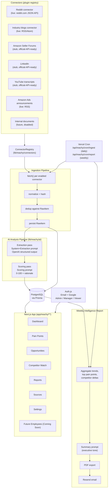
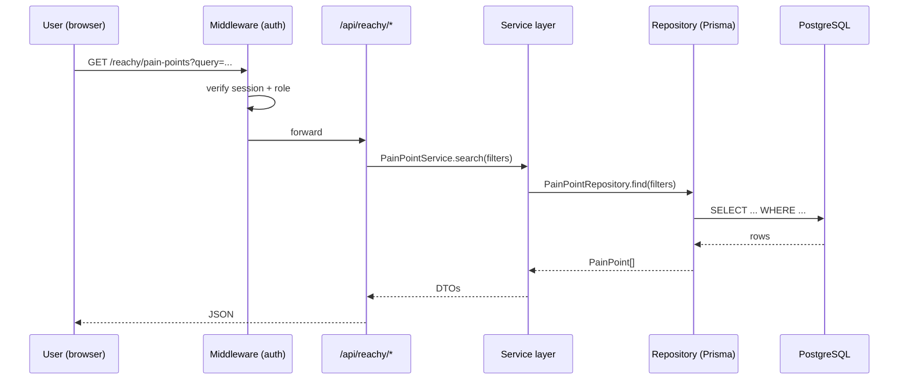
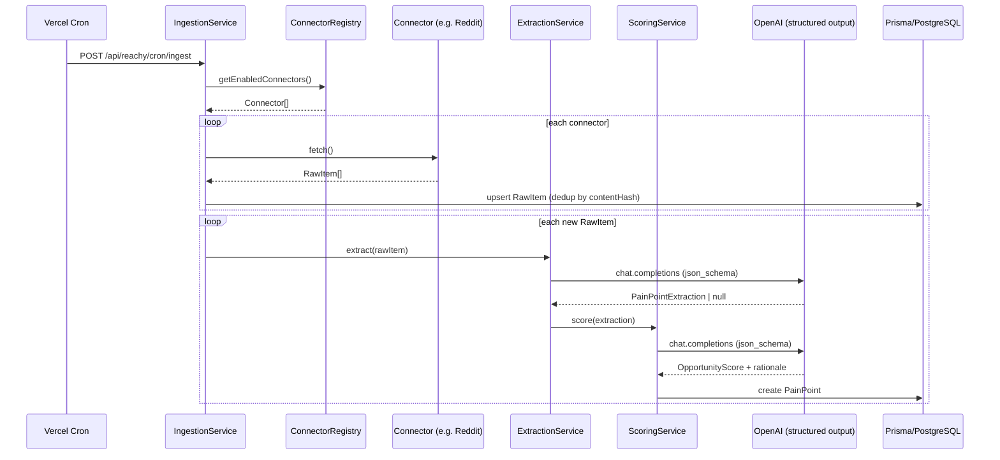
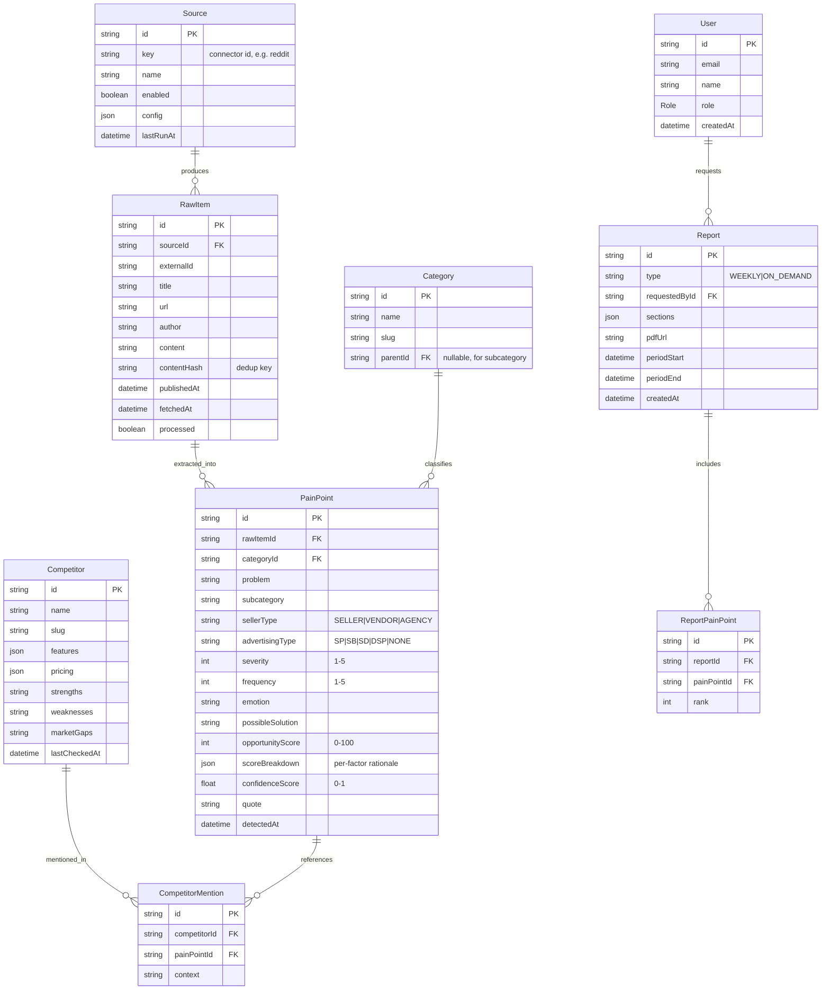

# Reachy — Product Requirements & Architecture

**Product:** Reachy, the first AI employee inside A One (Acosta One)
**Function:** Market Research for the Amazon Seller / Vendor / Advertising ecosystem
**Status:** Phase 1–5 implementation (this document is the source of truth; keep it updated as the system evolves)

This app is added **inside the existing `auditai` repo**, as a new, self-contained
section (`/reachy`) that does not touch the existing Acosta Audit Engine
product (`/`, `app/api/chat`, `app/api/pptx`, `lib/*Engine*`). It gets its own
route group, its own API namespace (`/api/reachy/*`), its own database schema,
and its own service layer under `lib/reachy/`. The two products share only the
Next.js app shell, Tailwind config, and hosting.

---

## 1. Vision

A One is an **AI workforce**, not a tool suite. Each AI employee owns one
business function end to end and is built so it can be dropped into the same
shell as every other employee:

| Employee | Function | Status |
|---|---|---|
| **Reachy** | Market Research | Building now |
| Marketing | Content Marketing & Lead Gen | Coming soon |
| Monitory | CRM & Lead Monitoring | Coming soon |
| Feedy | Customer Feedback | Coming soon |
| Brainy | Executive Decision Making | Coming soon |

To make that possible, everything below is built around three seams:

1. **Connector plugin architecture** — new data sources register themselves; the
   ingestion pipeline never special-cases a source by name.
2. **Employee registry** — the sidebar, route groups, and permission model are
   driven by a static registry of "employees," so adding Marketing/Monitory/
   Feedy/Brainy later is a registry entry + a route folder, not a rewrite.
3. **Modular AI prompts** — system / extraction / scoring / summary prompts are
   separate files with typed inputs/outputs, so other employees can reuse the
   same OpenAI client wrapper and structured-output helper.

## 2. Reachy's Job

Every day, Reachy:

1. **Gathers** raw content from enabled connectors (Reddit, Amazon Seller
   Forums, Amazon Advertising announcements, LinkedIn, industry blogs, YouTube
   transcripts, internal docs later).
2. **Normalizes & dedupes** raw content into `RawItem` rows (content hash +
   near-duplicate title check).
3. **Extracts** structured pain points from each item via an LLM extraction
   pass with a strict JSON schema (never free text).
4. **Scores** each pain point 0–100 on business opportunity, with a visible
   rationale per sub-factor.
5. **Aggregates** trends across categories/time and tracks named competitors.
6. **Stores** everything relationally so it's queryable, filterable, and
   auditable (every pain point links back to its source item and raw quote).
7. **Reports** — once a week (and on demand), compiles an executive
   intelligence report, exports it to PDF, and emails it via Resend.

## 3. Non-goals (Phase 1–5)

- No scraping that requires bypassing auth/ToS (LinkedIn, private forum
  sections) — those connectors ship as **stub implementations** behind the
  same interface, disabled by default, documented as needing an official API
  or partner feed.
- No multi-tenant org billing — single workspace, role-based users only.
- No real-time streaming ingestion — daily/weekly cron cadence.

---

## 4. System Architecture



### 4.1 Request flow (dashboard read)



### 4.2 Ingestion + AI pipeline (cron)



---

## 5. Database Schema (Prisma / PostgreSQL)

Full schema: [`prisma/schema.prisma`](../../prisma/schema.prisma). Summary:



`User`/`Account`/`Session`/`VerificationToken` follow the standard Auth.js
Prisma adapter shape (see schema file) and are additive to the ERD above.

---

## 6. Folder Structure

```
auditai/
├── app/
│   ├── page.tsx                     # existing Acosta Audit Engine (untouched)
│   ├── api/chat/, api/pptx/         # existing (untouched)
│   ├── reachy/                      # Reachy web UI (route group)
│   │   ├── layout.tsx               # sidebar shell, employee registry driven
│   │   ├── page.tsx                 # Dashboard
│   │   ├── pain-points/page.tsx
│   │   ├── opportunities/page.tsx
│   │   ├── competitors/page.tsx
│   │   ├── reports/
│   │   │   ├── page.tsx
│   │   │   └── [id]/page.tsx
│   │   ├── sources/page.tsx
│   │   └── settings/page.tsx
│   ├── login/page.tsx               # Auth.js sign-in page
│   └── api/
│       ├── auth/[...nextauth]/route.ts
│       └── reachy/
│           ├── pain-points/route.ts
│           ├── pain-points/[id]/route.ts
│           ├── opportunities/route.ts
│           ├── competitors/route.ts
│           ├── sources/route.ts
│           ├── sources/[id]/route.ts
│           ├── reports/route.ts
│           ├── reports/[id]/route.ts
│           ├── reports/[id]/pdf/route.ts
│           └── cron/
│               ├── ingest/route.ts
│               └── report/route.ts
├── lib/
│   ├── (existing audit engine files, untouched)
│   └── reachy/
│       ├── employees.ts             # employee registry (Reachy + Coming Soon)
│       ├── auth.ts                  # Auth.js config
│       ├── db.ts                    # Prisma client singleton
│       ├── logger.ts
│       ├── errors.ts
│       ├── connectors/
│       │   ├── types.ts             # Connector interface + registry
│       │   ├── registry.ts
│       │   ├── reddit.ts
│       │   ├── rss.ts               # generic RSS (blogs, Amazon Ads announcements)
│       │   ├── amazon-forums.ts     # stub
│       │   ├── linkedin.ts          # stub
│       │   └── youtube.ts           # stub
│       ├── ai/
│       │   ├── client.ts            # OpenAI client + structured-output helper
│       │   ├── schemas.ts           # JSON schemas + zod types
│       │   ├── prompts/
│       │   │   ├── system.ts
│       │   │   ├── extraction.ts
│       │   │   ├── scoring.ts
│       │   │   └── summary.ts
│       │   ├── extraction-service.ts
│       │   └── scoring-service.ts
│       ├── repositories/
│       │   ├── pain-point.repository.ts
│       │   ├── source.repository.ts
│       │   ├── competitor.repository.ts
│       │   └── report.repository.ts
│       └── services/
│           ├── ingestion.service.ts
│           ├── pain-point.service.ts
│           ├── opportunity.service.ts
│           ├── competitor.service.ts
│           └── report.service.ts
├── prisma/
│   ├── schema.prisma
│   └── seed.ts
├── components/reachy/                # dashboard cards, sidebar, tables, charts
├── docs/reachy/PRD.md                 # this file
└── vercel.json                        # cron schedules
```

---

## 7. API Contracts (`/api/reachy/*`)

All endpoints require an authenticated session (Auth.js) except `cron/*`,
which require a `CRON_SECRET` bearer token. Responses are JSON;
errors are `{ error: { code, message } }` with a matching HTTP status.

| Method | Path | Purpose | Roles |
|---|---|---|---|
| GET | `/api/reachy/pain-points` | Search/filter pain points. Query: `q, category, subcategory, sellerType, advertisingType, competitor, minScore, maxScore, from, to, page, pageSize` | Admin, Manager, Viewer |
| GET | `/api/reachy/pain-points/:id` | Single pain point with source + competitor mentions | Admin, Manager, Viewer |
| GET | `/api/reachy/opportunities` | Pain points ranked by opportunity score, with score breakdown | Admin, Manager, Viewer |
| GET | `/api/reachy/competitors` | List competitors + latest snapshot | Admin, Manager, Viewer |
| GET | `/api/reachy/competitors/:id` | Competitor detail + mentions | Admin, Manager, Viewer |
| GET | `/api/reachy/sources` | List connectors + enabled state + last run | Admin, Manager |
| PATCH | `/api/reachy/sources/:id` | Toggle enabled / update config | Admin |
| POST | `/api/reachy/sources/:id/run` | Manually trigger one connector | Admin |
| GET | `/api/reachy/reports` | List generated reports | Admin, Manager, Viewer |
| POST | `/api/reachy/reports` | Generate an on-demand report `{ periodStart, periodEnd }` | Admin, Manager |
| GET | `/api/reachy/reports/:id` | Report detail (sections JSON) | Admin, Manager, Viewer |
| GET | `/api/reachy/reports/:id/pdf` | Stream/download PDF | Admin, Manager, Viewer |
| POST | `/api/reachy/reports/:id/email` | Email report to given recipients | Admin, Manager |
| POST | `/api/reachy/cron/ingest` | Run all enabled connectors + extraction/scoring | cron secret |
| POST | `/api/reachy/cron/report` | Generate + email the weekly report | cron secret |

Example — `GET /api/reachy/pain-points?category=fees&minScore=70`:

```json
{
  "data": [
    {
      "id": "clx...",
      "problem": "Sellers can't tell which SKUs triggered a low-inventory fee before it hits",
      "category": "Fees & Reimbursements",
      "subcategory": "Low Inventory Fee",
      "sellerType": "SELLER",
      "advertisingType": "NONE",
      "severity": 4,
      "frequency": 5,
      "emotion": "frustrated",
      "opportunityScore": 82,
      "confidenceScore": 0.86,
      "source": { "connector": "reddit", "url": "https://reddit.com/..." }
    }
  ],
  "page": 1,
  "pageSize": 20,
  "total": 134
}
```

Example — `POST /api/reachy/reports`:

```json
// request
{ "periodStart": "2026-07-27", "periodEnd": "2026-08-03" }

// response
{
  "id": "clx...",
  "status": "READY",
  "sections": {
    "executiveSummary": "...",
    "topPainPoints": [ /* 10 */ ],
    "emergingTrends": [ /* ... */ ],
    "competitorAnalysis": [ /* ... */ ],
    "featureIdeas": [ /* ... */ ],
    "productsWorthBuilding": [ /* ... */ ],
    "revenueOpportunities": [ /* ... */ ],
    "recommendations": [ /* ... */ ]
  },
  "pdfUrl": "/api/reachy/reports/clx.../pdf"
}
```

---

## 8. Opportunity Scoring Model

`opportunityScore` (0–100) is a weighted sum of seven 0–10 sub-scores,
each produced by the LLM scoring pass with a one-line rationale, then
normalized:

| Factor | Weight |
|---|---|
| Frequency (how often this comes up) | 20% |
| Business Impact | 20% |
| Ease of Building (inverse effort) | 15% |
| Potential Revenue | 15% |
| AI Suitability | 15% |
| Urgency | 10% |
| Competition (inverse — less competition scores higher) | 5% |

`scoreBreakdown` is stored as JSON: `{ factor: { score: 0-10, weight, rationale } }[]`
so the UI can always show **why** a score was assigned.

---

## 9. Roles

- **Admin** — manage sources, users, generate/send reports, everything.
- **Manager** — view everything, generate on-demand reports, cannot toggle
  sources or manage users.
- **Viewer** — read-only across dashboard/pain points/opportunities/reports.

---

## 10. Roadmap (this build)

- **Phase 1** — deps, Prisma schema, Auth.js (email + Google, roles), Reachy
  shell (sidebar with employee registry incl. "Coming Soon" items), dashboard
  cards wired to real (empty-state-safe) queries.
- **Phase 2** — connector plugin framework, live Reddit + RSS connectors,
  stub connectors for Amazon Forums/LinkedIn/YouTube, ingestion pipeline with
  dedup, Sources page.
- **Phase 3** — modular AI prompts, structured-output extraction + scoring
  services, Pain Points storage end-to-end, Competitor model + Competitor
  Watch page.
- **Phase 4** — search/filter API + UI, Opportunities ranking page, weekly
  report generation, PDF export, Resend email, Vercel Cron wiring.
- **Phase 5** — input validation (zod) at every API boundary, structured
  logging, error handling, unit tests for scoring/dedup/report aggregation,
  README + env documentation.

## 11. Environment Variables

```
DATABASE_URL=                # PostgreSQL connection string
NEXTAUTH_SECRET=
NEXTAUTH_URL=
GOOGLE_CLIENT_ID=
GOOGLE_CLIENT_SECRET=
OPENAI_API_KEY=              # reused from existing app
RESEND_API_KEY=
REACHY_REPORT_FROM_EMAIL=
CRON_SECRET=                 # required bearer token for /api/reachy/cron/*
```
